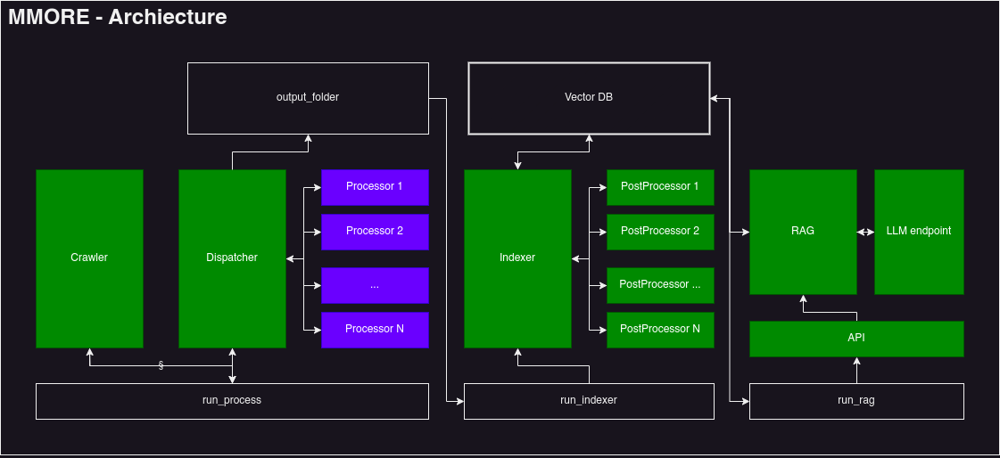

<h1 align="center">:cow: MMORE :robot:</h1>

  
  

####  
Massive Multimodal Open RAG & Extraction

A scalable multimodal pipeline for processing, indexing, and querying multimodal documents

Ever needed to take 8000 PDFs, 2000 videos, and 500 spreadsheets and feed them to an LLM as a knowledge base?
Well, MMORE is here to help you!

## Quick Start

### Installation

We currently support installation through rye. Refer to the documentation for instructions on installation.
The `scripts/setup.sh` script will install all the dependencies and install rye for you.

We also provide a docker image for easy deployment.

### Usage

To launch the MMORE pipeline follow the specialised instructions in the docs.

1. **:page_facing_up: Input Documents**  
   Upload your multimodal documents (PDFs, videos, spreadsheets, and more) into the pipeline.

2. [**:mag: Process**](./docs/process.md) 
   Extracts and standardizes text, metadata, and multimedia content from diverse file formats. Easily extensible ! Add your own processors to handle new file types.  
   *Supports fast processing for specific types.*

3. [**:file_folder: Index**](./docs/index.md) 
   Organizes extracted data into a **hybrid retrieval-ready Vector Store DB**, combining dense and sparse indexing through [Milvus](https://milvus.io/). Your vector DB can also be remotely hosted and only need to provide a standard API. 

4. [**:robot: RAG**](./docs/rag.md) 
   Use the indexed documents inside a **Retrieval-Augmented Generation (RAG) system**  that provides a [LangChain](https://www.langchain.com/) interface. Plug in any LLM with a compatible interface or add new ones through an easy-to-use interface.
   *Supports API hosting or local inference.*

5. **:tada: Evaluation**  
   *Coming soon*
   An easy way to evaluate the performance of your RAG system using Ragas

See [the `/docs` directory](/docs) for additional details on each modules and hands-on tutorials on parts of the pipeline.

#### :construction: Supported File Types  

| **Category**      | **File Types**                           | **Supported Device**      |  **Fast Mode**      |
|--------------------|------------------------------------------|--------------------------| --------------------------|
| **Text Documents** | DOCX, MD, PPTX, XLSX, TXT               | CPU                      | :x:
| **PDFs**           | PDF                                     | GPU/CPU                  | :white_check_mark:
| **Media Files**    | MP4, MOV, AVI, MKV, MP3, WAV, AAC       | GPU/CPU                  | :white_check_mark:
| **Web Content (TBD)**    | Webpages                                | GPU/CPU                  | :white_check_mark:

## Contributing

We welcome contributions to improve the current state of the pipeline, feel free to:

- Open an issue to report a bug or ask for a new feature
- Open a pull request to fix a bug or add a new feature
- You can find ongoing new features and bugs in the [Issues]
   
Don't hesitate to star the project :star: if you find it interesting! (you would be our star)

## License
This project is licensed under the Apache 2.0 License, see the [LICENSE :mortar_board:](LICENSE) file for details.

## Acknowledgements

This project is part of the [**OpenMeditron**](https://hugginface.co/OpenMeditron) initiative developed in [LiGHT](www.yale-light.org) lab at EPFL/Yale/CMU Africa in collaboration with the [**SwissAI**](https://www.swiss-ai.org/) initiative. Thank you Scott Mahoney, Mary-Anne Hartley
