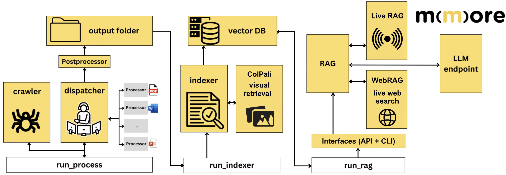

<h1 align="center">


</h1>

<p align="center">
  
  
  <a href="https://openreview.net/forum?id=6j1HjfIdKn">
    
  </a>
</p>

## Massive Multimodal Open RAG & Extraction

mmore is an open-source, end-to-end pipeline to ingest, process, index, and retrieve knowledge from heterogeneous files: PDFs, Office docs, spreadsheets, emails, images, audio, video, and web pages. It standardizes content into a unified multimodal format, supports distributed CPU/GPU processing, and provides hybrid dense+sparse retrieval with an integrated RAG service (CLI, APIs).

👉 Read the paper for more details (arXiv): [mmore: Massive Multimodal Open RAG & Extraction](https://arxiv.org/abs/2509.11937)


## Documentation

👉 Read the full documentation here: [mmore Documentation](https://EPFLiGHT.github.io/mmore/).


## :bulb: Quickstart

### Installation

> :whale: **Prefer Docker?** Skip the steps below and pull a pre-built multi-platform image directly from GHCR, with CPU and GPU variants:
> ```bash
> docker pull ghcr.io/EPFLiGHT/mmore:edge-gpu   # GPU (CUDA 12.6)
> docker pull ghcr.io/EPFLiGHT/mmore:edge-cpu   # CPU-only
> ```
> See [`docker/ubuntu/README.md`](docker/ubuntu/README.md) for build instructions and additional base OS variants (Arch Linux, openSUSE Leap).

#### (Step 0 – Install system dependencies)

Our package requires system dependencies. This snippet will take care of installing them for Linux!

```bash
sudo apt update
sudo apt install -y ffmpeg libsm6 libxext6 libnss3 \
  libxi6 libxrandr2 libxcomposite1 libxcursor1 libxdamage1 \
  libxfixes3 libxrender1 libasound2 libatk1.0-0 libgtk-3-0 libreoffice \
  libpango-1.0-0 libpangoft2-1.0-0 weasyprint
```

:warning: **On Ubuntu 24.04, replace `libasound2` with `libasound2t64`. You may also need to add the repository for Ubuntu 20.04 focal to have access to a few of the sources (e.g. create `/etc/apt/sources.list.d/mmore.list` with the contents `deb http://cz.archive.ubuntu.com/ubuntu focal main universe`).**

For MacOS, use instead:

```bash
brew update
brew install ffmpeg gtk+3 pango cairo \
  gobject-introspection libffi pkg-config libx11 libxi \
  libxrandr libxcomposite libxcursor libxdamage libxext \
  libxrender atk libreoffice weasyprint
```

If `weasyprint` fails to find GTK or Cairo, also run:

```bash
brew install cairo pango gdk-pixbuf libffi
uv pip install weasyprint
```

You can also run mmore on Windows by following our [Windows setup notes](docs/source/getting_started/windows.md).

#### Step 1 – Install mmore

Dependencies are split by pipeline stage. Install only what you need:

| Extra | What it includes |
|---|---|
| `process` | mmore's processing pipeline |
| `index` | mmore's indexing pipeline |
| `rag` | mmore's RAG pipeline (includes `index`) |
| `api` | FastAPI servers |
| `all` | Everything above |
| `websearch` | Web search pipeline (DuckDuckGo + optional Tavily) |
| `cpu` | PyTorch (CPU) + torchvision, for a CPU-only setup |
| `cu126` | PyTorch (CUDA 12.6) + torchvision, for a GPU setup |

**Full install (CPU):**

```bash
uv pip install "mmore[all,cpu]"
```

**Full install (GPU — CUDA 12.6):**

```bash
uv pip install "mmore[all,cu126]"
```

**Partial install example (processing only):**

```bash
uv pip install "mmore[process,cpu]"
```

> :warning: This package requires many big dependencies, so it is recommended to install with `uv` to handle `pip` installations. [Check our tutorial on uv](https://EPFLiGHT.github.io/mmore/advanced_usage/uv.html).

> :warning: **Check the instructions for contributors directly in the documentation [`for_devs.md`](https://EPFLiGHT.github.io/mmore/developer_documentation/for_devs.html).**

### Interactive TUI

Prefer a guided experience over editing YAML by hand? Install the `tui` extra and launch the interactive Terminal UI:

```bash
uv pip install "mmore[tui]"
mmore tui
```

From the launcher you can:

- run any stage (process / postprocess / index / rag / chat) interactively,
- chain the full pipeline (process → postprocess → index → chat),
- generate stage YAML configs through a guided wizard,
- pick from existing example configs without leaving the terminal.

### Minimal Example

You can use our predefined CLI commands to execute parts of the pipeline. Note that you might need to prepend `python -m` to the command if the package does not properly create bash aliases.

```bash
# Run processing
python -m mmore process --config-file examples/process/config.yaml
python -m mmore postprocess --config-file examples/postprocessor/config.yaml --input-data examples/process/outputs/merged/merged_results.jsonl

# Run indexer
python -m mmore index --config-file examples/index/config.yaml --documents-path examples/postprocessor/outputs/merged/results.jsonl

# Run RAG
python -m mmore rag --config-file examples/rag/config.yaml
```

You can also use our package in python code as shown here:

```python
from mmore.process.processors.pdf_processor import PDFProcessor
from mmore.process.processors.base import ProcessorConfig
from mmore.type import MultimodalSample

pdf_file_paths = ["/path/to/examples/sample_data/pdf/calendar.pdf"] #write here the full path, not a relative path
out_file = "/path/to/examples/process/outputs/example.jsonl"

pdf_processor_config = ProcessorConfig(custom_config={"output_path": "examples/process/outputs"})
pdf_processor = PDFProcessor(config=pdf_processor_config)
result_pdf = pdf_processor.process_batch(pdf_file_paths, False, 1) # args: file_paths, fast mode (True/False), num_workers

MultimodalSample.to_jsonl(out_file, result_pdf)
```

---

### Usage

To launch the mmore pipeline, follow the specialised instructions in the docs.




1. **:page_facing_up: Input Documents**
   Upload your multimodal documents (PDFs, videos, spreadsheets, and m(m)ore) into the pipeline.

2. [**:mag: Process**](https://EPFLiGHT.github.io/mmore/getting_started/process.html)
   Extracts and standardizes text, metadata, and multimedia content from diverse file formats. Easily extensible! You can add your own processors to handle new file types.
   *Supports fast processing for specific types.*

3. [**:file_folder: Index**](https://EPFLiGHT.github.io/mmore/getting_started/indexing.html)
   Organizes extracted data into a **hybrid retrieval-ready Vector Store DB**, combining dense and sparse indexing through [Milvus](https://milvus.io/). Your vector DB can also be remotely hosted and then you only have to provide a standard API. There is also an [HTTP Index API](https://EPFLiGHT.github.io/mmore/developer_documentation/index_api.html) for adding new files on the fly with HTTP requests.

4. [**:robot: RAG**](https://EPFLiGHT.github.io/mmore/getting_started/rag.html)
   Use the indexed documents inside a **Retrieval-Augmented Generation (RAG) system** that provides a [LangChain](https://www.langchain.com/) interface. Plug in any LLM with a compatible interface or add new ones through an easy-to-use interface.
   *Supports API hosting or local inference.*

5. [**:globe_with_meridians: Web Search**](https://EPFLiGHT.github.io/mmore/core_features/websearch.html)
   Augments RAG answers with live web search results using an iterative sub-query loop.
   DuckDuckGo is the default provider (free, no API key needed). Tavily is available as an optional higher-quality provider.
    ```bash
      # Install web search dependencies
      uv pip install "mmore[rag,websearch]"

      # Optional: use Tavily instead of DuckDuckGo
      export TAVILY_API_KEY=your_key_here
    ```

6. **:tada: Evaluation**
   *Coming soon*
   An easy way to evaluate the performance of your RAG system using Ragas.


#### :construction: Supported File Types

| **Category**      | **File Types**                           | **Supported Device**      |  **Fast Mode**      |
|--------------------|------------------------------------------|--------------------------| --------------------------|
| **Text Documents** | DOCX, MD, PPTX, XLSX, TXT, EML           | CPU                      | :x:
| **PDFs**           | PDF                                     | GPU/CPU                  | :white_check_mark:
| **Media Files**    | MP4, MOV, AVI, MKV, MP3, WAV, AAC       | GPU/CPU                  | :white_check_mark:
| **Web Content**    | HTML                                    | CPU                      | :x:

## License

This project is licensed under the Apache 2.0 License, see the [LICENSE :mortar_board:](LICENSE) file for details.

## Cite mmore

If you use mmore in your research, please cite the paper:
```bibtex
@misc{sallinen2025mmoremassivemultimodalopen,
      title={mmore: Massive Multimodal Open RAG & Extraction}, 
      author={Alexandre Sallinen and Stefan Krsteski and Paul Teiletche and Marc-Antoine Allard and Baptiste Lecoeur and Michael Zhang and Fabrice Nemo and David Kalajdzic and Matthias Meyer and Mary-Anne Hartley},
      year={2025},
      eprint={2509.11937},
      archivePrefix={arXiv},
      primaryClass={cs.SE},
      url={https://arxiv.org/abs/2509.11937}, 
}
```

<p align="center">
  <a href="https://www.star-history.com/?repos=EPFLiGHT%2Fmmore&type=date&legend=top-left">
  <picture>
    <source media="(prefers-color-scheme: dark)" srcset="https://api.star-history.com/chart?repos=EPFLiGHT/mmore&type=date&theme=dark&legend=top-left" />
    <source media="(prefers-color-scheme: light)" srcset="https://api.star-history.com/chart?repos=EPFLiGHT/mmore&type=date&legend=top-left" />
    
  </picture>
  </a>
</p>
