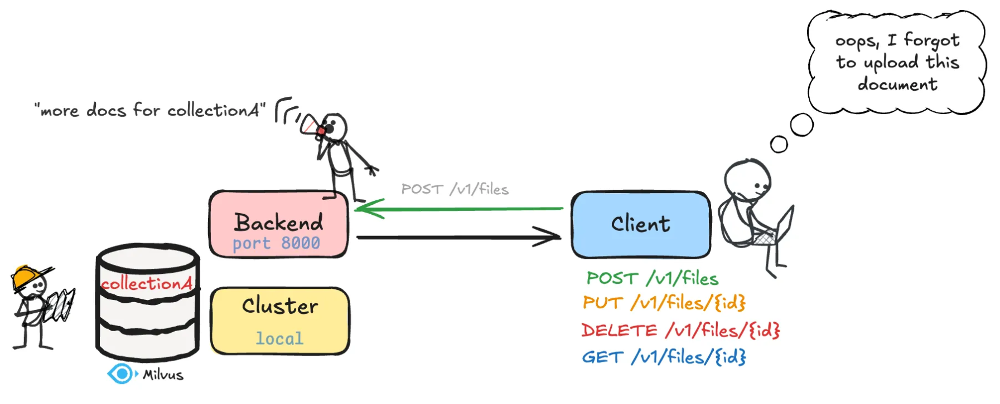

# m(m)ore Indexer API Documentation



## Overview

The **Indexer API** allows users to **upload, update, download, delete, and index documents** into a Milvus vector database for retrieval-augmented generation (RAG) and search applications. 

# Backend Server setup

Setup Instructions

1. **(Optional)** **Set Environment Variables**

If you would like to use a specific database and collection name please set the environment variables using the code below. Otherwise, the following default values will be used:

- Milvus uri = demo.db
- Milvus database name = my_db
- Collection name = my_documents

```bash
export MILVUS_URI="your_milvus_uri"
export MILVUS_DB="your_database_name"
export DEFAULT_COLLECTION="your_collection_name"
```

1. **Run the Server**

To start the server, run this command:

```bash
python3 -m mmore index-api --host the_host --port the_port
```

This command:

- Starts the Uvicorn ASGI server on the specified host and port
- Loads the FastAPI application from the `src/mmore/run_index_api.py` file

> **Important**: Keep this terminal window open. The backend runs in the foreground and closing the terminal will shut down the server.

---

# API Usage

## 📂 Upload Endpoints

### ▶️ `POST /v1/files`

**Upload a single file**

| Parameter | Type | Description |
| --- | --- | --- |
| `fileId` | `str` (form) | Unique identifier for the file |
| `file` | `UploadFile` (form) | File content to upload |
- Rejects duplicates by ID.
- Automatically processes and indexes the file.

**Response**:

```json
{
  "status": "success",
  "message": "File successfully indexed in my_documents collection",
  "fileId": "example123",
  "filename": "doc.pdf" }

```

---

### ▶️ `POST /v1/files/bulk`

**Upload multiple files with IDs**

| Parameter | Type | Description |
| --- | --- | --- |
| `listIds` | `List[str]` (form) | Comma-separated list of file IDs |
| `files` | `List[UploadFile]` (form) | Files to upload |
- Validates 1-to-1 correspondence between files and IDs.
- Processes and indexes each file with its corresponding ID.

**Response**:

```json
{
  "status": "success",
  "message": "Successfully processed and indexed 3 documents",
  "documents": [{"id": "doc1", "text": "First 50 characters..."}]
}
```

---

## 🔁 Update Endpoint

### ✏️ `PUT /v1/files/{id}`

**Replace an existing file and re-index**

| Parameter | Type | Description |
| --- | --- | --- |
| `id` | `str` (path) | Existing file ID |
| `file` | `UploadFile` (form) | New file to replace with |
- Deletes the previous vector entry.
- Re-indexes new content with the same ID.

**Response**:

```json
{
  "status": "success",
  "message": "File successfully updated",
  "fileId": "doc123",
  "filename": "new.pdf"
}
```

---

## 🗑️ Delete Endpoint

### ❌ `DELETE /v1/files/{id}`

**Delete a file and remove its vector entry**

| Parameter | Type | Description |
| --- | --- | --- |
| `id` | `str` (path) | ID of the file to delete |
- Deletes both local file and vector DB entry.

**Response**:

```json
{
  "status": "success",
  "message": "File successfully deleted",
  "fileId": "doc123"
}
```

---

## 📥 Download Endpoint

### 📄 `GET /v1/files/{id}`

**Download a file by its ID**

| Parameter | Type | Description |
| --- | --- | --- |
| `id` | `str` (path) | ID of the file to download |

Returns the file with binary content.

---

## How it works

1. **Upload** ➜ File saved temporarily.
2. **Process** ➜ Process the files
    1. **Crawling:** Files are parsed using `Crawler`.
    2. **Dispatching:** Dispatches the files to the proper processor using `Dispatcher`.
    3. **Processing:** Extracts text, images, and metadata and returns a `MultiModalSample`.
3. **Indexing** ➜ Vectors (dense + sparse) are stored in Milvus.

## 🧰 Developer Notes

- Vector database: **Milvus** via `pymilvus`.
- Default embedding models:
    - Dense: `sentence-transformers/all-MiniLM-L6-v2`
    - Sparse: `splade`
- File types supported:
    
    ```
    .pdf, .docx, .pptx, .md, .txt, .xlsx, .xls, .csv, .mp4, .avi, .mov, .mkv, .mp3, .wav, .aac, .eml, .html
    ```
    

### 💡 Tips

- Avoid duplicate `fileId` unless using `PUT` to update.
- You can test endpoints via Swagger UI at `/docs`.