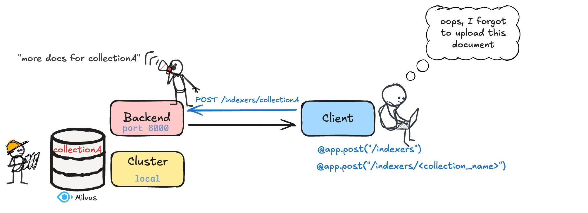

# Vector Database Indexer API Documentation



This documentation covers the backend server for the Index API, which provides RESTful endpoints for managing document vector databases. The server enables two primary functions:

1. **Creating Vector Databases**: Clients can create new vector databases and index their documents through a single API call (`POST /indexers`). This functionality mirrors the run_index command in the command-line interface.
2. **Adding Documents to Existing Collections**: The server also supports incrementally adding new documents to previously created collections via the `POST /indexers/{collection_name}` endpoint.

<details>
<summary><h2>Backend Server Setup</h2></summary>

### Setup Instructions

1. **Activate Virtual Environment**

```bash
# If using venv (standard Python virtual environment)
source .venv/bin/activate
```

1. **Install Dependencies**

Navigate to the index_api directory and install the necessary dependencies:

```bash
pip install -r requirements.txt
```

1. **Run the Backend Server**

To start the server, run this command in the index_api directory:

```bash
uvicorn main:app --reload
```

This command:

- Starts the Uvicorn ASGI server
- Loads the FastAPI application from the [main.py](http://main.py) file
- Binds it to all network interfaces (0.0.0.0)
- Makes it listen on port 8000

> **Important**: Keep this terminal window open. The backend runs in the foreground and closing the terminal will shut down the server.

</details>

<details>
<summary><h2>API Usage</h2></summary>

### 1. Create an Indexer

`POST /indexers`

This is the equivalent of running run_index, where you create an indexer and index your files.

### Example request body

```json
{
  "config": {
    "dense_model_name": "sentence-transformers/all-MiniLM-L6-v2",
    "sparse_model_name": "splade",
    "is_multimodal": false,
    "db_uri": "demo.db",
    "db_name": "my_db"
  },
  "collection_name": "my_documents",
  "documents_path": "/path/to/documents.jsonl",
  "batch_size": 64
}
```
<details>

<summary><str>Parameters description</str></summary>
    
    
    | Parameter | Type | Default (N/A if none) | Description |
    | --- | --- | --- | --- |
    | `config.dense_model_name` | `str` | N/A | Name of the dense embedding model |
    | `config.sparse_model_name` | `str` | N/A | Name of the sparse embedding model |
    | `config.is_multimodal` | `boolean` | `False` | Whether the models support multimodal content (text + images) |
    | `config.db_uri` | `str` | `“demo.db”` | Milvus database URI |
    | `config.db_name` | `str` | `“my_db”` | Milvus database name |
    | `collection_name` | `str` | `“my_docs”` | Name for your document collection |
    | `documents_path` | `str` | N/A | Path to JSONL file containing documents |
    | `batch_size` | `int` | `64` | Number of documents to process at once |
  </details>

### 2. Add Documents to Existing Collection
</details>
